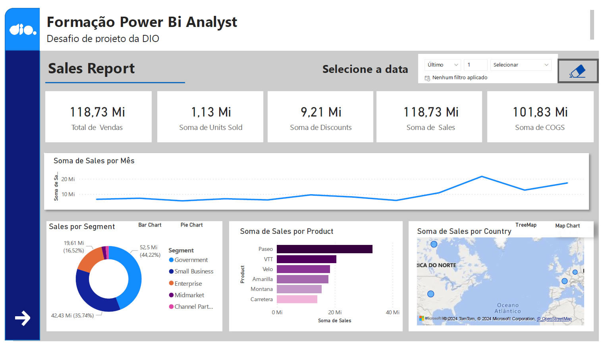
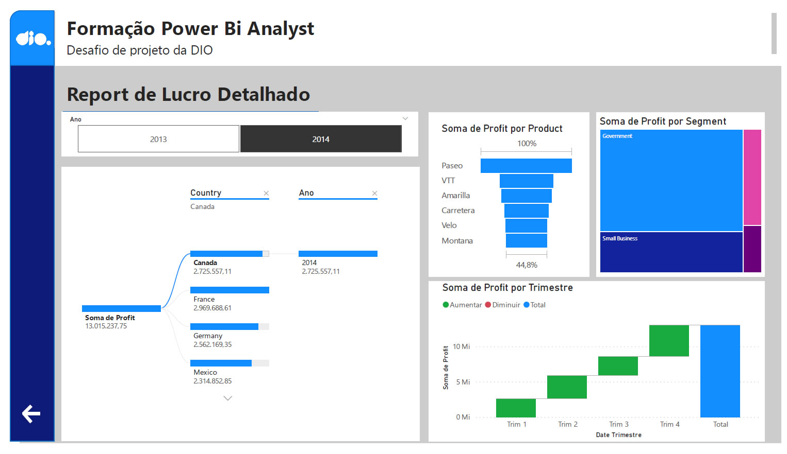

# DESAFIO POWERBI #
## Criação de visuais ##

Neste desafio foram criadas duas páginas de relatórios utilizando diferentes tipos de visuais. Os dados utilizados vieram de uma planilha no formato Excel fornecida junto com o desafio chamada Financial Sample.xlsx.

Recursos utilizados:
- Navegação entre relatórios
- Troca de visuais através de clique em botão (marcadores)
- Gráficos de barras e linhas
- Arvore hierárquica
- Mapa
- Treemap

Abaixo seguem prints dos dois relatórios criados durante o desafio

**Relatório 1**

**Relatório 2**

